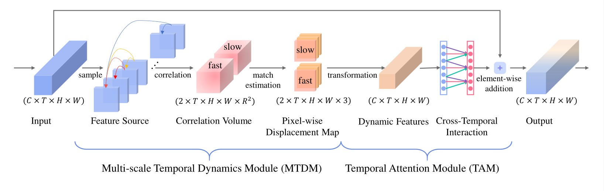

# Temporal Correlation Module
## Overview
We release the PyTorch code of the Temporal Correlation Module.


## Requirements
* Python >= 3.6
* Pytorch >= 1.2 with CUDA
* [Pytorch-Correlation-extension](https://github.com/ClementPinard/Pytorch-Correlation-extension)
* pip install -r requirements.txt

## Data Preparation
The data preparation is the same as [TSM](https://github.com/mit-han-lab/temporal-shift-module), please refer to [TSM](https://github.com/mit-han-lab/temporal-shift-module) repo for the detailed guide of data pre-processing.

## Training

For training TCM with TSM_RseNet50 on something-something V1 with 8-segments input (4 NVIDIA 2080TI GPUS used here):
```
export CUDA_VISIBLE_DEVICES=0,1,2,3
python -u main_something.py something RGB \
"/path/to/somethingV1/train_videofolder.txt" "/path/to/somethingV1/val_videofolder_latest.txt" \
--arch "TCM_resnet50" --num_segments 8 --mode 1 --gd 200 --lr 0.01 --lr_steps 30 40 45 --epochs 50 -b 32 -i 1 -j 4 --dropout 0.5 \
 --snapshot_pref logs --consensus_type avg --eval-freq 1 --rgb_prefix "" \
 --no_partialbn --val_output_folder logs -p 20 --nesterov "True" \
 2>&1 | tee -a logs/log.txt
```

**Note the learning rate should match the batch size. For example, if you increase the batch size from 32 to 64, the corresponding learning rate should be 0.01\*(64/32)=0.02**

## Testing
For testing on something-something V1 with 8-segments input:
```
python -u main_something.py something RGB \
"/path/to/somethingV1/train_videofolder.txt" "/path/to/somethingV1/val_videofolder_latest.txt" \
--arch "TCM_resnet50" --num_segments 8 --mode 1 --gd 200 --lr 0.01 --lr_steps 30 40 45 --epochs 50 -b 32 -i 1 -j 4 --dropout 0.5 \
 --snapshot_pref logs --consensus_type avg --eval-freq 1 --rgb_prefix "" \
 --no_partialbn --val_output_folder logs -p 20 --nesterov "True" \
 --evaluate  --resume "/PATH/TO/SAVED/WEIGHT/FILE" \
 2>&1 | tee -a logs/log.txt
```

